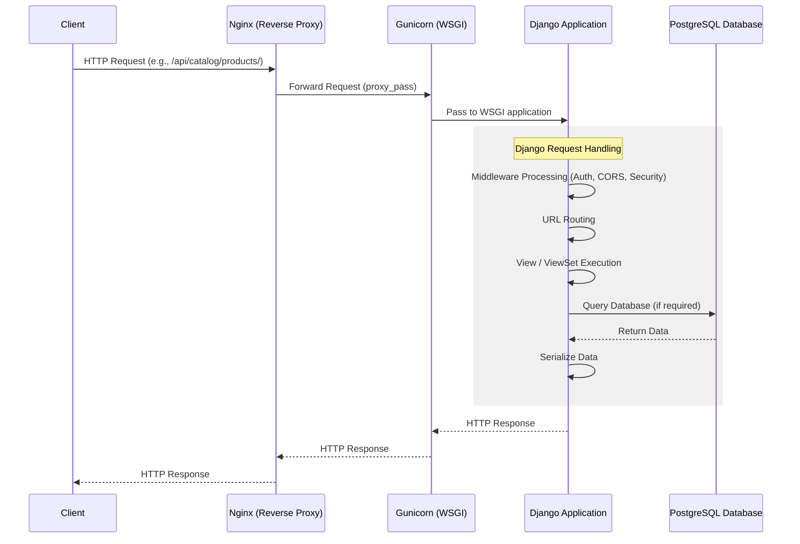

# Application Flow

The following diagram illustrates the typical request-response lifecycle for the E-Commerce Backend application.

## Key Components

1. **Client**: The frontend application, mobile app, or API consumer making HTTP requests.
2. **Nginx**: Acts as a reverse proxy, handling static files directly and routing dynamic requests to Gunicorn. Provides SSL termination (in production).
3. **Gunicorn**: The WSGI HTTP Server for Python that interfaces between Nginx and the Django application. It manages multiple worker processes to handle concurrent requests.
4. **Django Application**: The core backend logic. Handles authentication, permissions, data validation, business logic, and database interactions using the Django ORM.
5. **PostgreSQL Database**: The relational database management system storing all persistent data (Users, Products, Categories, etc.).
