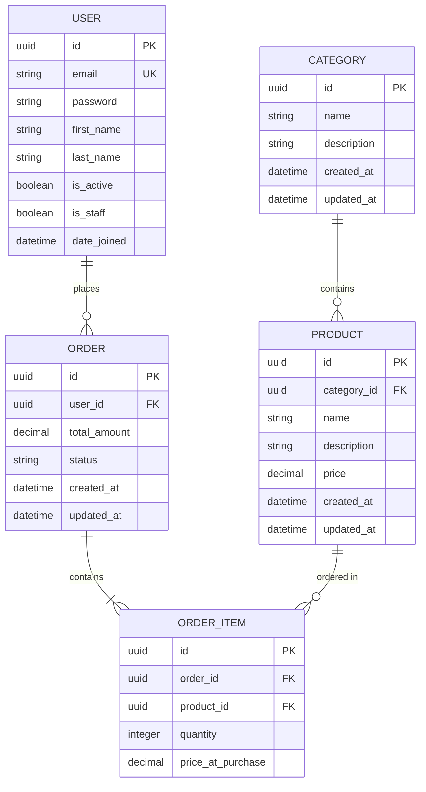

# Database Relationships

This Entity-Relationship Diagram (ERD) outlines the core database models and their relationships in the E-Commerce Backend.

> [!NOTE]
> The `Order` and `Order Item` models represent the upcoming Phase 2 implementation for order management. Currently, the system implements `User`, `Category`, and `Product`.

## Key Entities

*   **User**: Represents an authenticated user of the system (customers and admins). Uses an email-based authentication approach.
*   **Category**: A hierarchical grouping for products to allow easy navigation and filtering.
*   **Product**: The core entity representing an item available for purchase. Belongs to a single `Category`.
