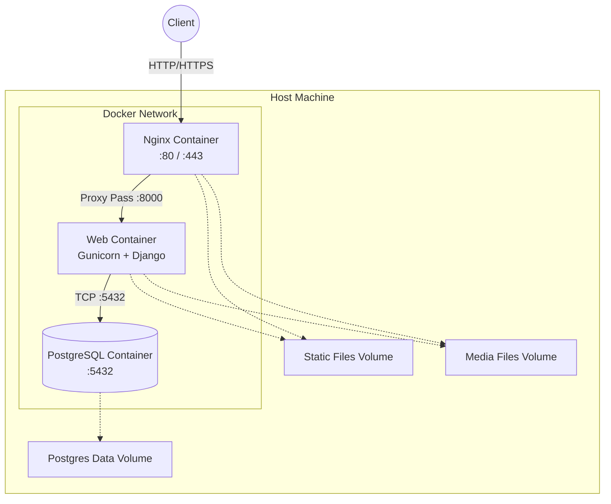

# Deployment Architecture (Docker Compose)

This document describes the containerized deployment architecture used for local development, staging, and single-server production environments using Docker Compose.



## Containers

1.  **Nginx (`nginx`)**: 
    *   Acts as the entry point for all traffic.
    *   Serves static and media files directly from shared Docker volumes.
    *   Reverse proxies dynamic API requests to the `web` container.
2.  **Web (`web`)**: 
    *   Runs the Django application served by Gunicorn.
    *   Handles all application logic.
    *   Executes database migrations on startup.
3.  **Database (`db`)**: 
    *   Runs PostgreSQL 15.
    *   Data is persisted using a named Docker volume (`postgres_data`) so data survives container restarts.

## Volumes

*   **`postgres_data`**: Persists the PostgreSQL database files.
*   **`static_volume`**: Shared between `web` (which collects static files via `collectstatic` on startup) and `nginx` (which serves them to clients).
*   **`media_volume`**: Shared between `web` (where user uploads are saved) and `nginx` (to serve the uploads).

## Scaling

While this architecture is excellent for a single server (like an EC2 instance or DigitalOcean Droplet), scaling requires moving to an orchestration platform like AWS ECS or Kubernetes (see the AWS Infrastructure documentation). You can scale the `web` container horizontally in Docker Compose using:

```bash
docker-compose up -d --scale web=3
```
Nginx will automatically round-robin requests among the available `web` containers.
